# Multi-Factor Portfolio Research Framework — Indian Equities

A systematic multi-factor equity research project for the Indian Large + Mid Cap universe,
built and documented in the style of institutional quantitative research. A composite four-factor
model ranks a dynamically-reconstituted universe; the Top 20 are selected, weighted two ways, and
rebalanced at three frequencies; performance is then evaluated through a realistic walk-forward
backtest, benchmark comparison, transaction-cost sensitivity, holdings-rotation quality, factor
attribution, and market-regime conditioning.

This is a research methodology demonstration, not a live trading system or a return-maximisation
exercise — every design decision is disclosed and explained in [`docs/design_decisions.md`](docs/design_decisions.md),
and every number below is taken directly from the notebooks, not projected or illustrative.

---

## Universe & Setup

| | |
|---|---|
| **Universe** | SEBI Large Cap + Mid Cap (AMFI classification), dynamically reconstituted every 6 months — 17 snapshots, 2018-06-30 → latest |
| **Final research universe** | 404 tickers, 2,755 trading days of price history |
| **Factor model** | Momentum (40%) · Low Volatility (20%) · Maximum Drawdown (20%) · Beta (20%) |
| **Portfolio** | Top 20 by composite score — Equal Weight vs. True Equal Risk Contribution (ERC) |
| **Rebalancing** | Monthly / Quarterly / Semi-Annual |
| **Backtest window** | 2018-07-01 → present (warm-up from 2015-07-01 for factor lookback) |
| **Transaction cost** | 20 bps one-way turnover (default), swept 0–50 bps |
| **Benchmarks** | NIFTY 50 (primary) · Universe Average Return (secondary) |
| **Data sources** | AMFI (classification) · yfinance (prices, NSE-listed only) |

---

## Research Questions

1. Does the composite-factor portfolio systematically outperform relevant benchmarks?
2. Does risk-based weighting (ERC) differ meaningfully from naive Equal Weight?
3. How sensitive is performance to rebalancing frequency?
4. How large is transaction-cost drag, and how does it scale with rebalancing frequency?
5. Does performance vary systematically across market regimes?

All five are answered below and in full in the notebooks; condensed narrative in
[`Executive_Summary.md`](Executive_Summary.md).

---

## Notebooks

### `NB01_Universe_Construction.ipynb` — Universe Construction

Builds a point-in-time-correct, dynamically reconstituted investable universe rather than a
static one — a static universe would exclude stocks that migrate into Large/Mid Cap after the
study begins and retain ones that later fall out of scope, introducing a selection bias
correlated with the very factors under study (e.g. momentum-driven capitalisation growth). Every
ticker's corporate-action status (renamed / merged / delisted / failed / unknown) is explicitly
resolved via a Corporate Action Registry — nothing is silently dropped.

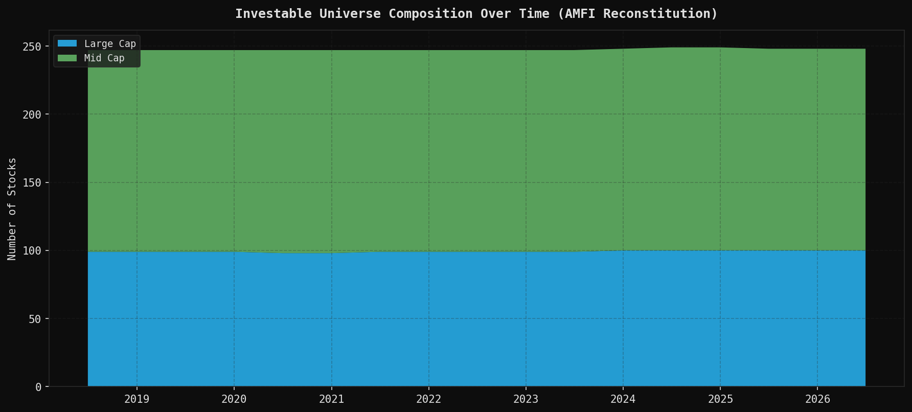

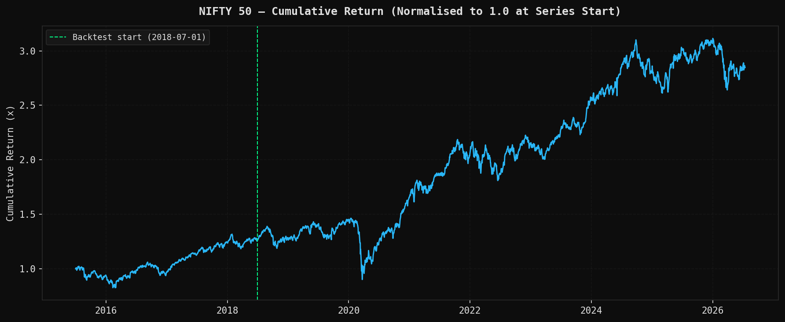

**Result:** 441 tickers ever classified Large/Mid Cap → 404 in the final research universe (35
excluded, each with an explicit, auditable reason). NIFTY 50 CAGR over the backtest window:
10.68%; universe median annualised return: 19.32% — wide cross-sectional dispersion, the
necessary precondition for a factor model to have any discriminating power downstream.

---

### `NB02_Factor_Research.ipynb` — Factor Research (v2)

Four factors, computed entirely from price/return data — no fundamentals dependency (the original
design's Quality and Value factors were dropped after yfinance's point-in-time fundamentals
coverage proved structurally poor across the backtest window; see `docs/design_decisions.md`):

$$\text{Composite}(t,i) = 0.40\,z_{\text{Mom}} + 0.20\,z_{\text{LowVol}} + 0.20\,z_{\text{MaxDD}} + 0.20\,z_{\text{Beta}}$$

Weights are locked by design intent, before any backtest was run — never tuned against
performance. Full formulas for each factor are in [`docs/methodology.md`](docs/methodology.md#2-factor-model-nb02-v2--locked).

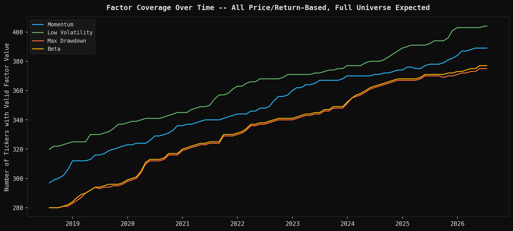

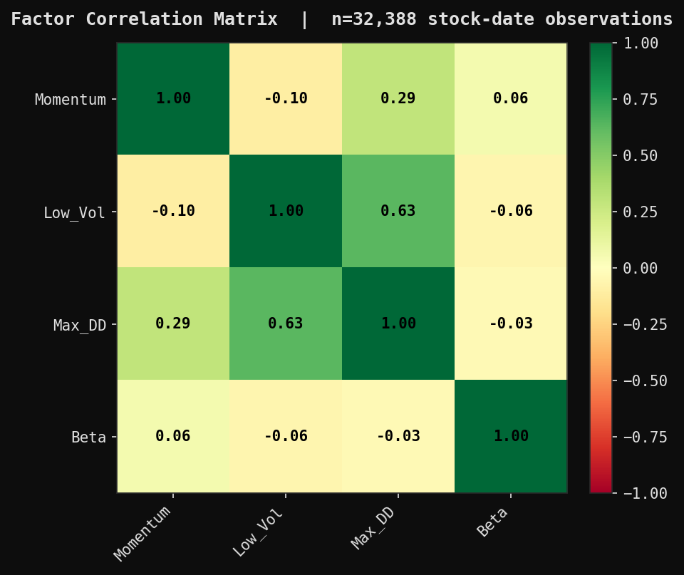

**Result:** eligible (all-four-factors-present) universe grows from 280 to 375 stocks across 97
rebalance dates — never falling below the 20-stock minimum NB03 requires. The correlation review
confirms the intended structure: positive but not redundant correlation between Low Volatility and
Maximum Drawdown, and a near-orthogonal Beta factor.

---

### `NB03_Portfolio_Construction.ipynb` — Portfolio Construction

Selects the Top 20 by composite score at each rebalance date and constructs two weighting
schemes — naive Equal Weight, and True Equal Risk Contribution (ERC), solved via `scipy.optimize`
so each stock contributes equally to *portfolio risk* (not capital) given the full covariance
structure:

$$\min_w \sum_{i=1}^{N}\left(\text{RC}_i - \frac{\sigma_p^2}{N}\right)^2 \quad\text{s.t.}\quad \sum_i w_i=1,\ w_i\ge0$$

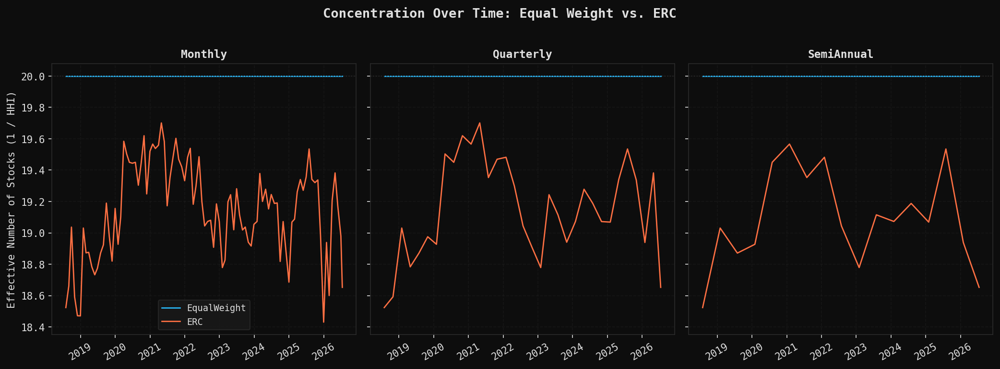

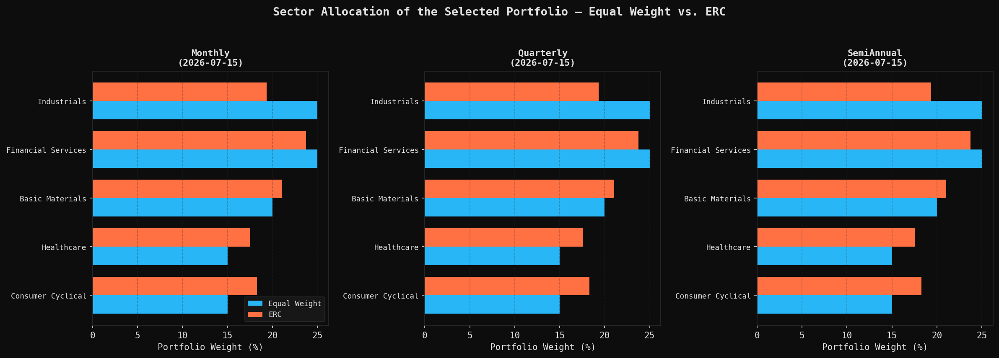

**Result:** Equal Weight holds an effective N of exactly 20.00 at every frequency; ERC's is only
marginally lower (19.07–19.17) — a modest, not extreme, risk-based tilt. Both schemes select the
identical Top-20 stock set at every date; only the *allocation* across sectors and cap classes
differs.

---

### `NB04_WalkForward_Backtest.ipynb` — Walk-Forward Backtest

Compounds NB03's target weights into daily returns under realistic mechanics: weights drift with
daily returns between rebalances (no artificial daily re-weighting), and a one-way-turnover × 20
bps transaction cost is deducted at each rebalance date, combining the buy and sell legs into a
single cost rather than doubling them.

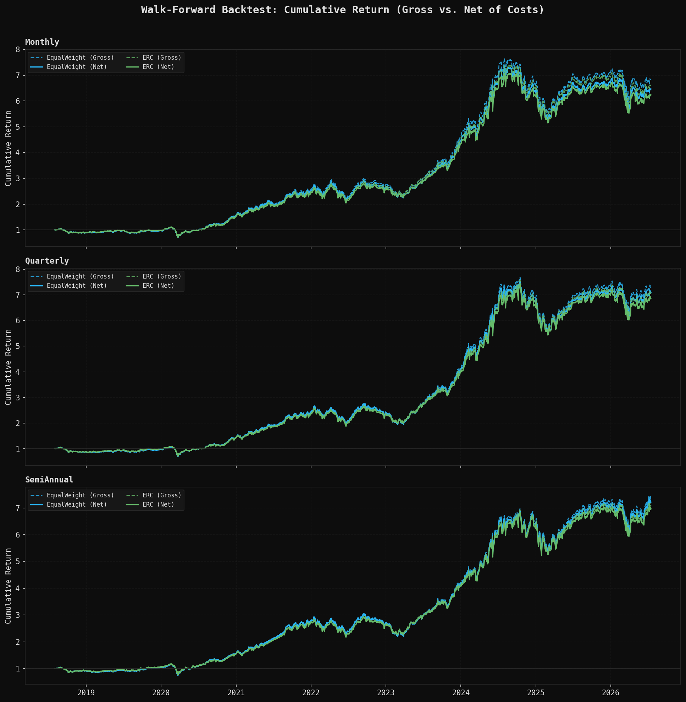

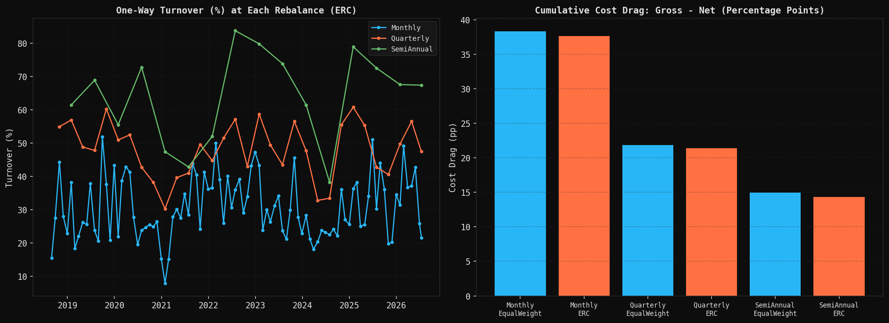

**Result:** cumulative cost drag scales directly with rebalancing frequency — from ~38 percentage
points (Monthly) down to ~15pp (Semi-Annual) over the full backtest, roughly 2.6× higher at
Monthly than Semi-Annual, tracking the ratio of rebalance counts (96 vs. 16) almost exactly.

---

### `NB05_Portfolio_Analytics.ipynb` — Portfolio Analytics

The core results notebook. Computes risk-adjusted performance metrics, benchmark-relative metrics
against NIFTY 50, a closed-form transaction-cost sensitivity sweep (validated against a full
engine re-run to floating-point precision), sector analytics, **Rotation Analysis** (was each
holdings swap, in retrospect, worth it?), and **Factor Attribution** (does the realised portfolio
actually tilt the way the composite score was designed to?).

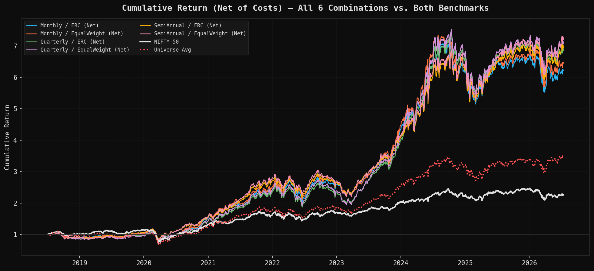

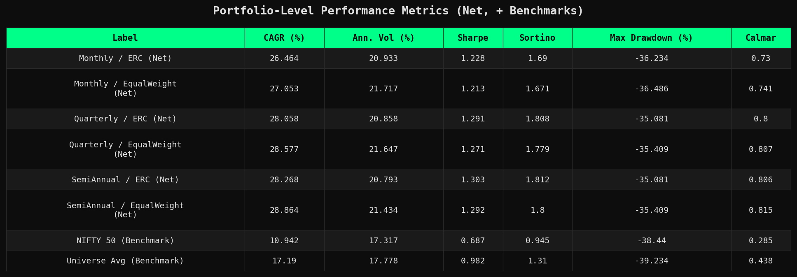

**Headline result:** every one of the six (frequency × weighting scheme) combinations
outperformed both NIFTY 50 and Universe Average Return on every portfolio-level metric — CAGR
26.5–28.9% vs. 10.9% (NIFTY 50) and 17.2% (Universe Avg); Sharpe 1.21–1.30 vs. 0.69 and 0.98;
Beta consistently below 1.0 (0.938–0.957) alongside positive annualised Alpha (+15.1% to +17.0%).

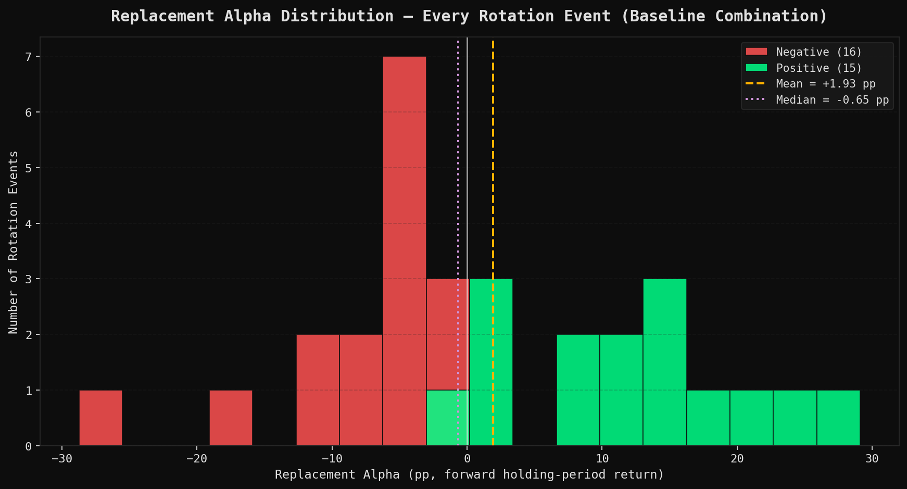

**Rotation Analysis result — a real qualification, not just a footnote:** 31 rotation events,
48.4% success rate (barely above a coin flip), mean Replacement Alpha +1.93pp but **median −0.65pp**
— the top 3 rotations account for 42.0% of all positive replacement alpha. The value of ongoing
Top-20 reconstitution in this backtest owes more to a handful of large successful swaps than to a
broadly consistent edge across most individual trades.

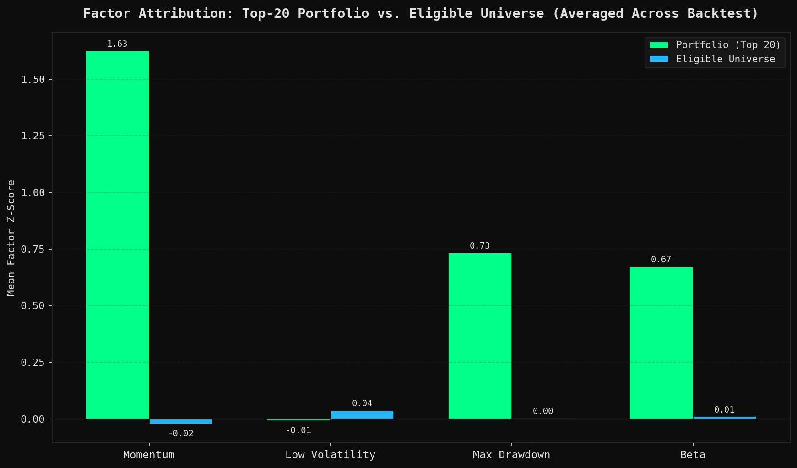

**Factor Attribution result — confirmatory:** the realised portfolio's largest tilt is toward
Momentum (+1.65z), the factor carrying the largest locked weight (40%) — verifying the composite
score does what it was designed to do, not revealing something new.

---

### `NB06_Regime_Diagnostics.ipynb` — Regime Diagnostics

Fits a 3-state Gaussian HMM (Bull / Bear / High Volatility) on **NIFTY 50 returns only** — never
on portfolio returns, never feeding back into portfolio construction — then overlays the baseline
combination's (Quarterly + Equal Weight) realised performance onto the resulting regime timeline,
strictly post-hoc.

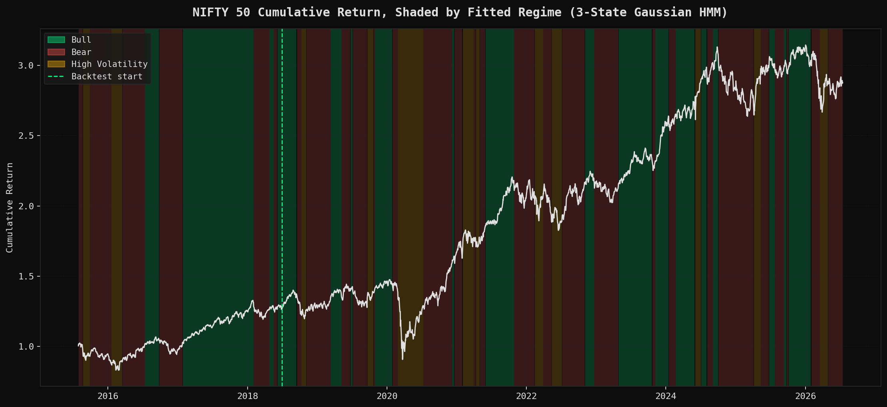

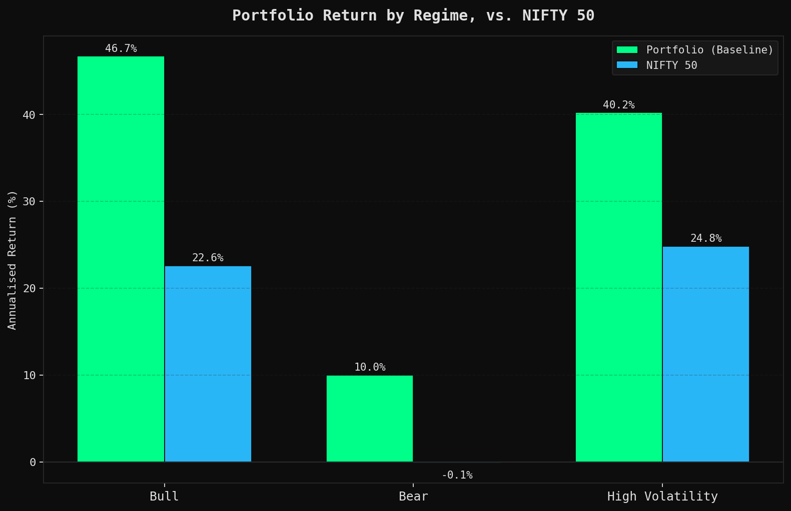

**Result:** the HMM converged and identified 3 regimes with reasonably stable persistence (only
1.7% of regime runs lasted ≤3 days). The baseline combination outperformed NIFTY 50's annualised
return in **every regime present** during the backtest window — Bull (+46.7% vs +22.6%, Sharpe
3.00), Bear (+10.0% vs −0.12%), High Volatility (+40.2% vs +24.8%) — indicating the headline
outperformance is not an artifact of favourable performance in only one type of market
environment.

---

## Cross-Notebook Synthesis

The outperformance documented above:
- **scales inversely with transaction-cost drag** (NB04) — less frequent rebalancing edges out
  more frequent rebalancing on Net returns;
- **survives a full cost-sensitivity sweep** (NB05) — material but not overwhelming, even at 50bps;
- **is partly concentrated rather than uniformly distributed** across individual trades (NB05
  Rotation Analysis) — an honest qualification, not a contradiction;
- **arises from the intended factor tilts** (NB05 Factor Attribution) — confirmatory, not a new
  finding;
- **holds across all three market regimes tested** (NB06) — not a one-environment artifact.

Full numeric detail for every claim above is in [`docs/key_findings.md`](docs/key_findings.md).

---

## Full Chart Index

The `output/` folder contains all charts and tables generated across the six notebooks (41
images), named `NN_description.png` by notebook number. Highlights above are a curated subset;
the full set — including per-frequency Top-20/buffer tables, cap-class allocation, rolling
rotation success rate, drawdown/cost-sweep/sector-evolution panels, and the regime transition
matrix heatmap — is browsable directly in that folder.

---

## Stack

Python · pandas · NumPy · SciPy (`scipy.optimize`) · matplotlib · yfinance · hmmlearn

## Setup

```bash
pip install pandas numpy scipy matplotlib yfinance hmmlearn openpyxl
```

Notebooks must be run **in order, NB01 → NB06** — each reads only the `data/` artifacts the
previous notebook wrote (no direct notebook-to-notebook import). NB01 requires live network
access to AMFI and Yahoo Finance; NB02–NB06 run offline against cached CSVs once `data/` is
populated. Full dependency map in [`docs/repository_guide.md`](docs/repository_guide.md).

## Documentation Index

| Document | Purpose |
|---|---|
| [`Executive_Summary.md`](Executive_Summary.md) | Condensed report for PM / hiring-manager review |
| [`docs/methodology.md`](docs/methodology.md) | Full methodology, formulas, and definitions |
| [`docs/design_decisions.md`](docs/design_decisions.md) | Rationale behind every locked design choice |
| [`docs/assumptions.md`](docs/assumptions.md) | Every project assumption, in one place |
| [`docs/key_findings.md`](docs/key_findings.md) | Actual computed results, per notebook |
| [`docs/repository_guide.md`](docs/repository_guide.md) | How to navigate and run this project |
| [`docs/references.md`](docs/references.md) | Methodological references |

---

## Limitations (Full Disclosure)

- Survivorship bias between semi-annual AMFI snapshots; NSE-only listings.
- No Quality or Value factors, due to yfinance's limited point-in-time fundamentals coverage.
- Transaction cost model is turnover × basis points only — no market impact, spread, or slippage.
- Rotation Analysis's Replacement Alpha definition and Factor Attribution's tilt threshold are
  disclosed reporting choices, not locked project conventions.
- Regime labels (NB06) are a modelling choice (3 features, 3 states, 21-day volatility window),
  not ground truth; the overlay is observational and non-causal.
- Results describe a specific historical backtest window and do not constitute a forward-looking
  performance guarantee.

---
*This project is a research and portfolio-methodology demonstration. Nothing in this repository
constitutes investment advice or a recommendation to buy or sell any security.*
