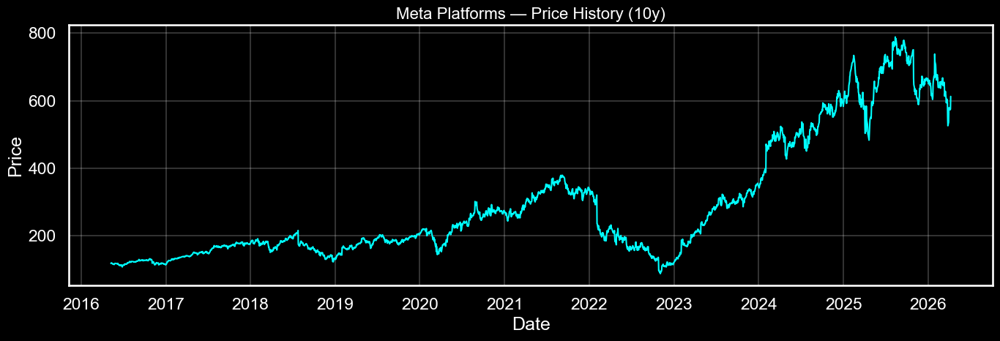
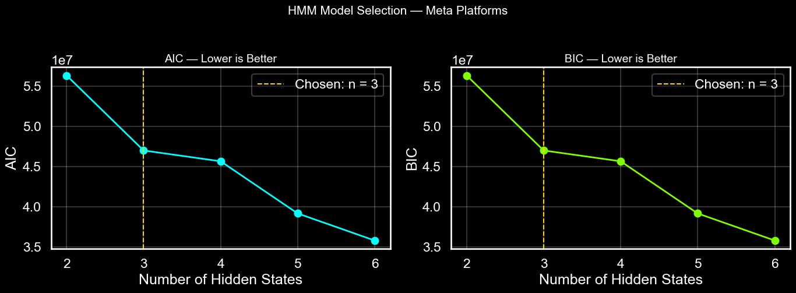
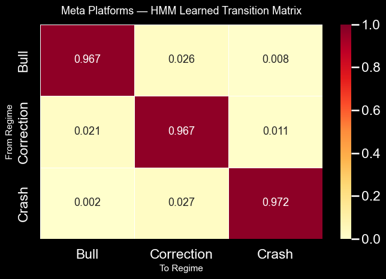
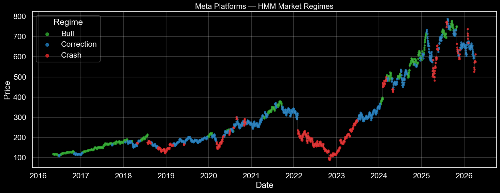
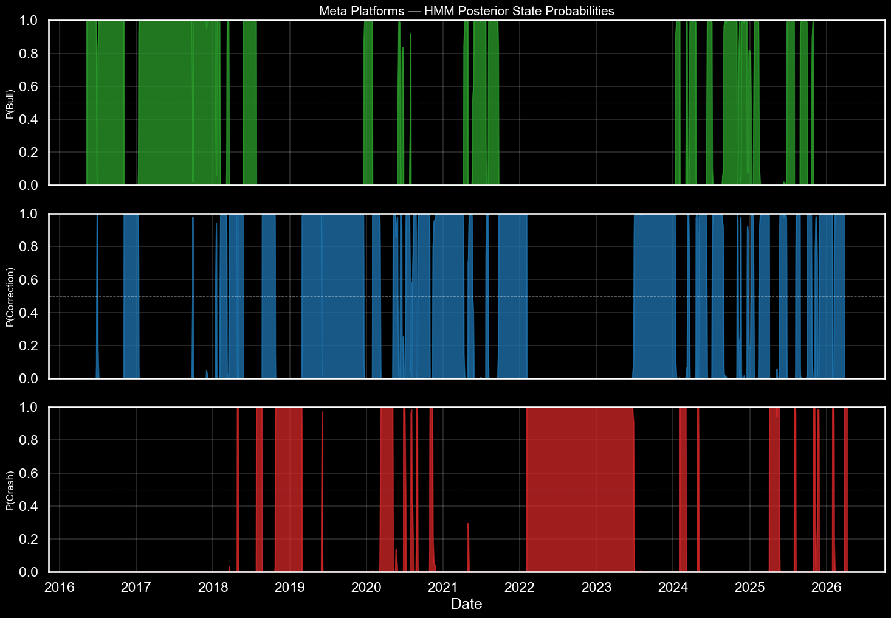
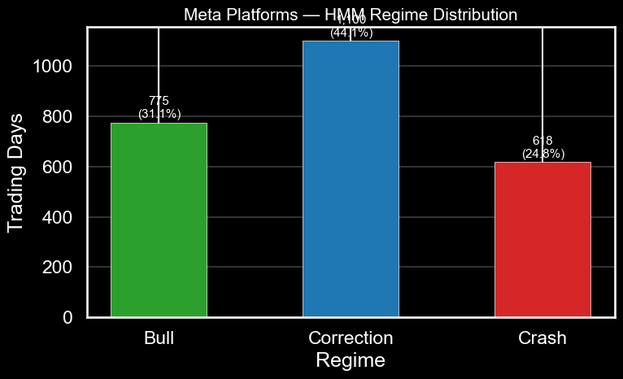
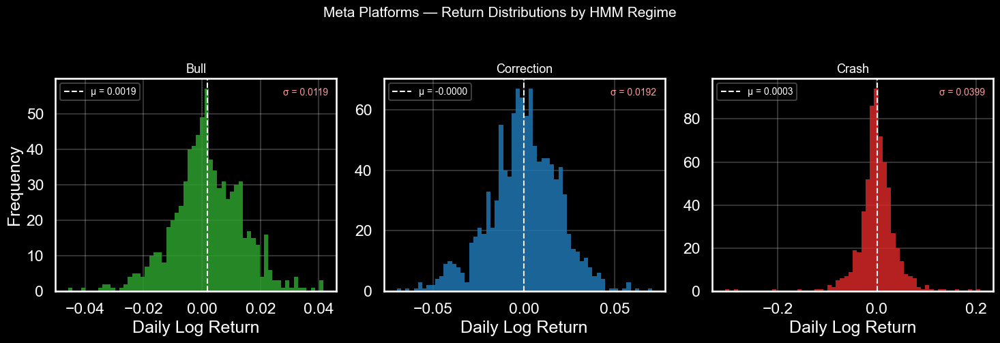
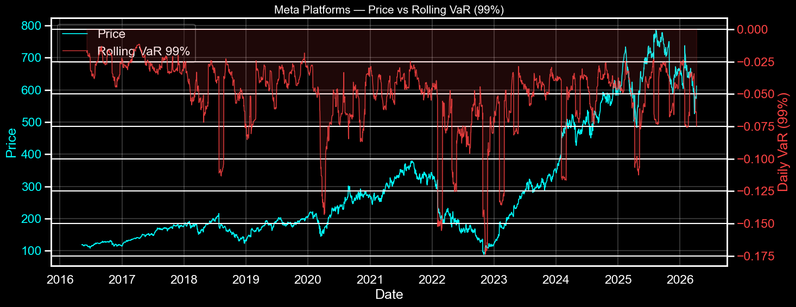
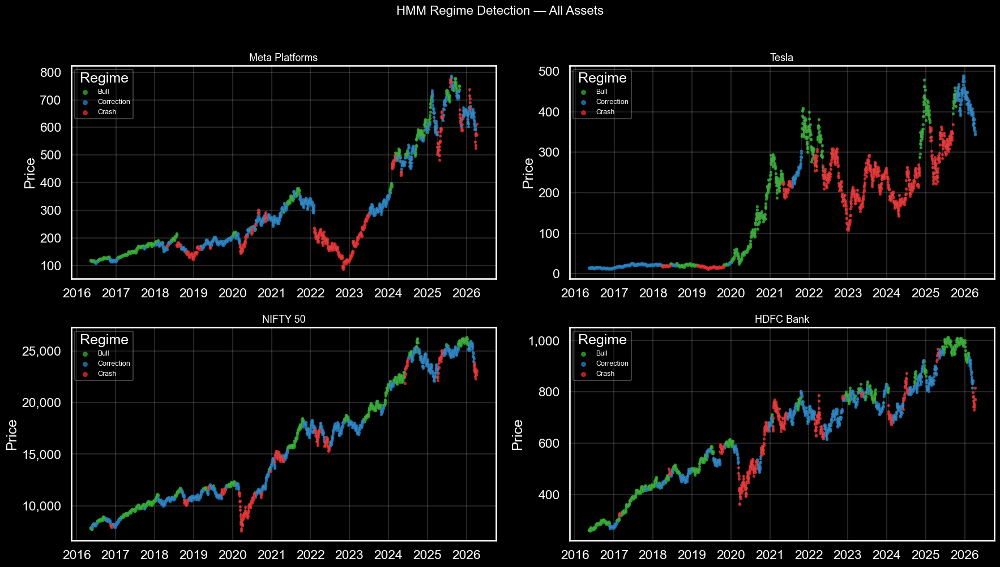

# Hidden Markov Model — Regime Detection — Meta Platforms

> Detecting latent market regimes using a Gaussian Hidden Markov Model — a sequential probabilistic model that explicitly accounts for the time-ordered nature of financial data.

---

## What is a Hidden Markov Model?

An HMM assumes the market is always in one of *n* unobservable (hidden) states. What we observe — returns, volatility, drawdown — are **emissions** from those hidden states. Unlike K-Means, which treats every day as independent, HMM knows that today's regime is strongly related to yesterday's.

The model simultaneously learns three things during training:

| Parameter | What it encodes |
|---|---|
| Emission distributions | What each regime looks like in feature space |
| **Transition matrix** | How likely it is to move between regimes — **learned during training, not post-hoc** |
| Initial distribution | Probability of starting in each state |

Training uses **Baum-Welch** (Expectation-Maximisation). Decoding uses the **Viterbi algorithm** to find the most likely state sequence given all observations.

---

## Why HMM Over K-Means?

| Property | K-Means | HMM |
|---|---|---|
| Time ordering | Ignored | Core to the model |
| Transition probabilities | Computed post-hoc | **Learned during training** |
| Regime assignment | Hard — 0 or 1 | Soft — probability per state |
| Uncertainty quantification | Not available | ✅ Posterior probability bands |
| Next-day prediction | Not possible | ✅ Via transition matrix |
| Industry usage | Portfolio attribution | Risk systems, volatility targeting |

---

## Features

| Feature | Formula | What it captures |
|---|---|---|
| `Return` | ln(Pₜ / Pₜ₋₁) | Daily direction and magnitude |
| `GARCH_vol` | GARCH(1,1) conditional σ | Forward-looking volatility estimate |
| `Volatility` | 20-day rolling σ | Realised short-term volatility |
| `Momentum` | Pₜ / Pₜ₋₂₀ − 1 | 1-month trend — scale-independent |
| `Drawdown` | (Pₜ − max P) / max P | Distance from all-time high |

---

## Primary Asset — Meta Platforms (META)

10 years of daily data · May 2016 → April 2026 · 2,493 trading days  
Model converged: ✅ True · Log-likelihood: −9,427.53

### Price History



---

### Model Selection — AIC & BIC

HMM uses **AIC and BIC** (information criteria) rather than elbow/silhouette. Both penalise model complexity — lower is better. AIC and BIC both continue falling past n = 3, suggesting the data contains more than three patterns statistically. **n = 3 is chosen deliberately** for financial interpretability — Bull / Correction / Crash maps cleanly to actionable market states. This is a documented modelling decision, not an oversight.



---

### Learned Transition Matrix

This is the defining advantage of HMM. The transition matrix is a **core model parameter** learned from data during Baum-Welch training — not computed after the fact like in K-Means.

The empirical matrix (computed from the decoded sequence) matched the learned matrix with a mean absolute difference of just **0.0003**, confirming excellent model convergence.



```
Learned Transition Matrix:
              Bull    Correction   Crash
Bull         0.967       0.026    0.008
Correction   0.021       0.967    0.011
Crash        0.002       0.027    0.972
```

Key findings from the transition matrix:
- **Crash → Bull direct probability: 0.2%** — recoveries almost never jump directly from crash to bull. The path is always Crash → Correction → Bull
- All three regimes are highly persistent — diagonal values all above 96.6%
- Crash is the most persistent regime (97.2%) — once META enters a crash, it stays there

---

### Regime-Colored Price Chart



The HMM correctly identifies the 2022–2023 META collapse as a sustained Crash regime (red), the moderate corrections in 2018–2020 as Correction (blue), and the strong trending periods as Bull (green). As of April 2026 — **current regime: Crash**, day 9, with 97.2% probability of remaining in Crash tomorrow.

---

### Posterior State Probabilities — Unique to HMM

This plot is impossible to produce with K-Means. It shows the model's **daily confidence** in each regime. Values near 1.0 indicate certainty; values between 0.3–0.7 represent genuine regime ambiguity that K-Means would force into a hard assignment.



- **Green panel (Bull):** Solid blocks in 2016–2017 and 2024. Sharp black spikes show the exact days of regime transition — the model is confident when in bull
- **Blue panel (Correction):** Highly dynamic — the model frequently sees mixed Bull/Correction signals, reflecting the choppy nature of consolidation phases
- **Red panel (Crash):** Near-zero most of the time, then sharp spikes to 1.0 at the 2018 Q4 selloff, COVID flash crash, 2022–2023 collapse, and the current 2026 drawdown

---

### Regime Distribution

HMM classifies META's history very differently from K-Means. Where K-Means found 77% Bull days, HMM finds only **31% Bull** — because HMM accounts for sequential persistence and separates true trending days from choppy moderate-volatility days that K-Means lumped into Bull.



| Regime | Days | % of History |
|---|---|---|
| Bull | 775 | 31.1% |
| Correction | 1,100 | 44.1% |
| Crash | 618 | 24.8% |

---

### Return Distributions Per Regime

The three distributions show clearly distinct volatility profiles. Bull is tight (σ = 1.19%), Correction is moderate (σ = 1.92%), and Crash is wide (σ = 3.99%) with visible fat tails. The Crash regime has a near-zero mean return (μ = 0.0003) — HMM classifies this regime by its **volatility structure**, not just its return level, which is statistically more robust.



---

### Price vs Rolling VaR (99%)

VaR spikes align precisely with the regime chart — the deepest red spikes (highest risk) correspond to periods classified as Crash. Parametric Gaussian VaR underestimates true tail risk in crash regimes due to fat-tailed return distributions — a known limitation acknowledged here.



---

## Key Results — Meta Platforms

### Regime Statistics

| Regime | Return | Volatility | Drawdown | VaR 99% | Avg Duration |
|---|---|---|---|---|---|
| **Bull** | +0.190% | 1.28% | −1.94% | −2.96% | 29.8 days |
| **Correction** | −0.003% | 1.96% | −12.55% | −4.47% | 30.6 days |
| **Crash** | +0.033% | 3.56% | −39.31% | −9.33% | 34.3 days |

### Regime Persistence — Learned, Not Empirical

| Regime | Learned Persistence | Theoretical Duration | Empirical Duration |
|---|---|---|---|
| Bull | 96.7% | 30.0 days | 29.8 days ✅ |
| Correction | 96.7% | 30.4 days | 30.6 days ✅ |
| Crash | 97.2% | 35.3 days | 34.3 days ✅ |

Theoretical duration = 1 / (1 − persistence), derived analytically from the learned transition matrix. The close match with empirical durations validates the model has correctly captured the sequential dynamics of META.

### Stationary Distribution

The long-run equilibrium — derived mathematically from the transition matrix:

| Regime | Long-run Probability |
|---|---|
| Bull | 29.7% |
| Correction | 44.3% |
| Crash | 26.0% |

### Current Regime — As of April 8, 2026

```
Current Regime : Crash
Days in regime : 9
Crash probability today : 99.9%
Tomorrow → Bull : 0.2%  |  Correction : 2.7%  |  Crash : 97.2%
```

---

## Cross-Asset Overview

The same HMM applied to Tesla, NIFTY 50, and HDFC Bank. Tesla shows rapid regime switching and prolonged red periods post-2020. NIFTY 50 shows clear sequential progression with minimal crash exposure. HDFC Bank alternates more frequently than the broad index.



---

## Limitations

- **In-sample only** — no out-of-sample or walk-forward validation
- **Stationary transition probabilities** — the model assumes switching probabilities are constant over 10 years; in reality, macro conditions shift them
- **Gaussian emissions** — assumes returns within each regime are normally distributed; fat tails in the crash regime mean tail risk is underestimated
- **AIC/BIC favour more states** — n = 3 is chosen for interpretability over statistical optimality
- **No portfolio application** — regime signals are not yet used for position sizing or allocation

---

## How to Run

```bash
pip install yfinance pandas numpy matplotlib seaborn scikit-learn arch hmmlearn
jupyter notebook HMM_Regime_Detection.ipynb
```

Change `SYMBOL` at the top of the notebook to run on any asset:

```python
SYMBOL = 'META'       # Options: 'META', 'TSLA', '^NSEI', 'HDFCBANK.NS'
```

---

*See the `KMeans/` folder for the baseline static clustering model. The core difference: K-Means computes its transition matrix after classification — HMM learns it as a model parameter during training.*
