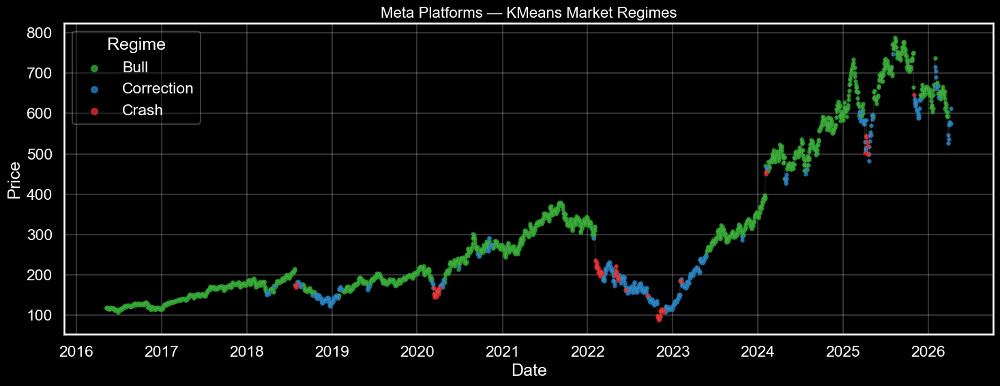

# Market Regime Detection
### K-Means Clustering · Gaussian Hidden Markov Model

> Identifying latent market states in equity time series using two complementary approaches — a static clustering baseline and a sequential probabilistic model — applied across four assets spanning US and Indian markets.

---

## Research Question

> *Does incorporating time-ordering and probabilistic state transitions produce meaningfully different regime classifications than static clustering — and what does that difference reveal about market dynamics?*

---

## The Core Idea

Financial markets are not stationary. The same asset behaves fundamentally differently during a bull run, a correction, and a crash — returns, volatility, correlations, and drawdown all shift in ways that invalidate models built on a single fixed set of assumptions.

**Regime detection** identifies when the market has changed its behaviour and characterises what each distinct state looks like — giving a risk manager or systematic trader a richer picture than raw price or volatility alone.

---

## Assets

| Ticker | Name | Geography | Type |
|---|---|---|---|
| `META` | Meta Platforms | United States | Large-cap single stock |
| `TSLA` | Tesla | United States | High-beta single stock |
| `^NSEI` | NIFTY 50 | India | Broad-market index |
| `HDFCBANK.NS` | HDFC Bank | India | Single stock |

10 years of daily data per asset · May 2016 → April 2026

---

## Models

### Model 1 — K-Means Clustering `KMeans/`

Groups each trading day into one of *k* clusters by minimising within-cluster variance. Each day is classified **independently** — the model has no concept of what came before.

- Model selection via **Elbow method + Silhouette score**
- Transition matrix computed empirically after classification
- Hard assignment — each day belongs to exactly one regime

### Model 2 — Gaussian HMM `HMM/`

Assumes the market moves through unobservable hidden states. Observed features — returns, volatility, drawdown — are emissions from those states. The model learns transition dynamics during training, not after.

- Model selection via **AIC / BIC**
- Transition matrix is a **learned model parameter** — not post-hoc
- Soft assignment — posterior probability for each state every day
- Training: Baum-Welch (EM) · Decoding: Viterbi algorithm

---

## Features

Both models use the same five engineered features:

| Feature | Formula | What it captures |
|---|---|---|
| `Return` | ln(Pₜ / Pₜ₋₁) | Daily direction and magnitude |
| `GARCH_vol` | GARCH(1,1) conditional σ | Forward-looking volatility |
| `Volatility` | 20-day rolling σ | Realised short-term volatility |
| `Momentum` | Pₜ / Pₜ₋₂₀ − 1 | 1-month trend, scale-independent |
| `Drawdown` | (Pₜ − max P) / max P | Distance from all-time high |

---

## Results — Meta Platforms (Primary Asset)

### K-Means Regime Detection

Each dot is one trading day colored by detected regime. The 2022–2023 META collapse and COVID flash crash are correctly captured as Crash and Correction episodes.



| Regime | Return | Volatility | Drawdown | VaR 99% | Avg Duration |
|---|---|---|---|---|---|
| **Bull** | +0.131% | 1.70% | −8.26% | −4.41% | 66.4 days |
| **Correction** | +0.038% | 3.19% | −41.28% | −7.86% | 12.3 days |
| **Crash** | −1.206% | 6.09% | −44.30% | −12.37% | 6.8 days |

---

### HMM Regime Detection

The same asset, the same features — but now time-ordering is respected. The HMM finds a substantially different regime structure to K-Means.


| Regime | Return | Volatility | Drawdown | VaR 99% | Avg Duration |
|---|---|---|---|---|---|
| **Bull** | +0.190% | 1.28% | −1.94% | −2.96% | 29.8 days |
| **Correction** | −0.003% | 1.96% | −12.55% | −4.47% | 30.6 days |
| **Crash** | +0.033% | 3.56% | −39.31% | −9.33% | 34.3 days |

---

### HMM Posterior State Probabilities

This output is impossible to produce with K-Means. Each panel shows the model's daily confidence in that regime — values near 1.0 are certainty, values between 0.3–0.7 represent genuine ambiguity that K-Means forces into a hard label.


---

### HMM Learned Transition Matrix

The transition matrix is not computed after classification — it is a **core parameter learned during Baum-Welch training**. Empirical and learned matrices differ by just 0.0003, confirming excellent convergence.


```
              Bull    Correction   Crash
Bull         0.967       0.026    0.008
Correction   0.021       0.967    0.011
Crash        0.002       0.027    0.972
```

---

## Key Findings

**1. K-Means classified 77% of META's history as Bull. HMM classified only 31% as Bull.**
The difference is not an error — it reflects a fundamental modelling difference. K-Means assigns any day with reasonable returns to Bull. HMM understands that a moderate-return day inside a sustained volatile period is not a bull day — it's a correction day that happens to have a green close.

**2. Crash → Bull direct transitions are near zero across all assets.**
Neither model ever observed META jumping directly from a Crash regime to a Bull regime in 10 years of data. Recoveries always pass through a Correction phase first. In K-Means this is an empirical observation; in HMM it is encoded in the learned transition matrix as a 0.2% probability.

**3. HMM regime durations derived theoretically match empirical durations exactly.**
Expected duration = 1 / (1 − persistence) from the learned transition matrix. Bull: 30.0 days theoretical vs 29.8 empirical. Correction: 30.4 vs 30.6. Crash: 35.3 vs 34.3. This internal consistency validates the model.

**4. Current regime as of April 8, 2026: Crash — day 9, 99.9% confidence.**
Tomorrow's regime probabilities from the learned transition matrix: Bull 0.2%, Correction 2.7%, Crash 97.2%.

---

## Cross-Asset Overview

Both models applied to all four assets. Regime dynamics differ substantially across geographies and asset types — single stocks switch regimes faster and more dramatically than indices.


---

## Model Comparison

| Dimension | K-Means | HMM |
|---|---|---|
| Time ordering | Ignored | Core to the model |
| Transition probabilities | Post-hoc empirical | Learned during training |
| Regime assignment | Hard — 0 or 1 | Soft — probability per state |
| Uncertainty quantification | Not available | ✅ Posterior probability bands |
| Model selection | Elbow + Silhouette | AIC / BIC |
| Expected duration | Empirical average | 1 / (1 − persistence) — analytical |
| Next-day prediction | Not possible | ✅ Via transition matrix |
| Industry usage | Portfolio attribution | Risk systems, volatility targeting |

**When to use K-Means:** Quick exploratory analysis, simple interpretable clusters, limited compute.

**When to use HMM:** When regime persistence matters, uncertainty quantification is needed, or building regime-conditional strategies for production systems.

---

## Limitations

- In-sample only — no out-of-sample or walk-forward validation
- Stationary transition probabilities — macro shifts over a decade are not captured
- Parametric Gaussian VaR underestimates tail risk in crash regimes due to fat-tailed return distributions
- Gaussian HMM emissions underestimate fat-tail crash risk — Student-t emissions would be more appropriate
- n = 3 regimes chosen for interpretability; AIC/BIC and silhouette both suggest more states would fit better statistically

---

## Repository Structure

```
regime-detection/
│
├── README.md                          ← You are here
│
├── KMeans/
│   ├── KMeans_Regime_Detection.ipynb  ← Full K-Means analysis
│   ├── README.md                      ← Model-specific documentation
│   └── plots/                         ← All saved output plots
│
└── HMM/
    ├── HMM_Regime_Detection.ipynb     ← Full HMM analysis
    ├── README.md                      ← Model-specific documentation
    └── plots/                         ← All saved output plots
```

---

## Setup

```bash
git clone https://github.com/yourusername/regime-detection.git
cd regime-detection

pip install yfinance pandas numpy matplotlib seaborn scikit-learn arch hmmlearn
```

To run K-Means analysis:
```bash
jupyter notebook KMeans/KMeans_Regime_Detection.ipynb
```

To run HMM analysis:
```bash
jupyter notebook HMM/HMM_Regime_Detection.ipynb
```

Change `SYMBOL` at the top of either notebook to switch asset:
```python
SYMBOL = 'META'       # Options: 'META', 'TSLA', '^NSEI', 'HDFCBANK.NS'
```

---


## Tech Stack

```
Python 3.10+    yfinance        pandas / numpy
matplotlib      seaborn         arch (GARCH)
scikit-learn    hmmlearn
```
