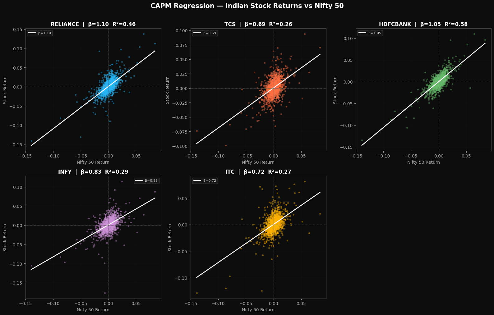
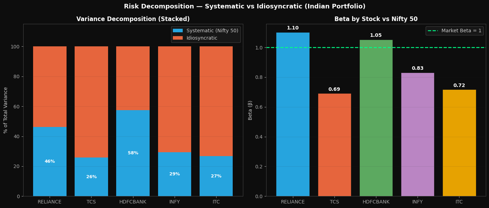
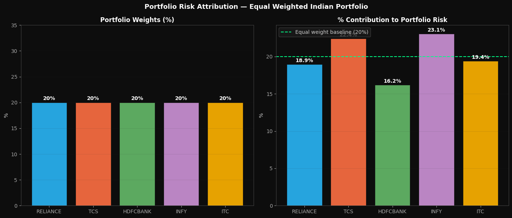
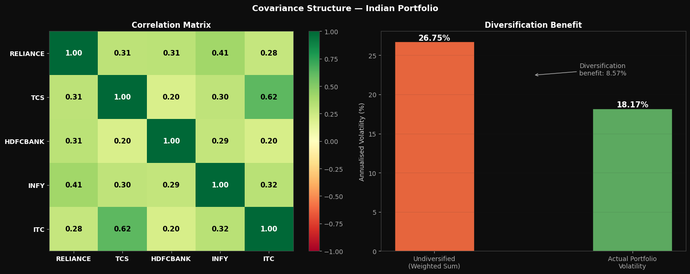
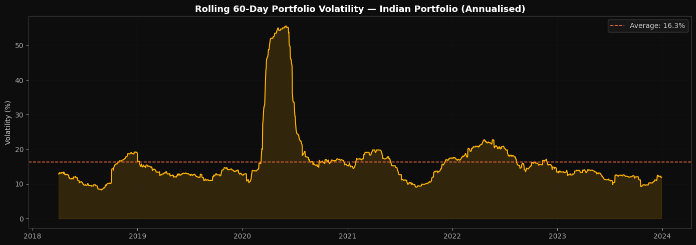
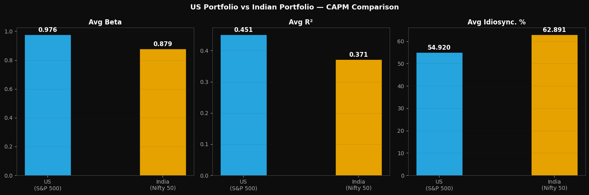
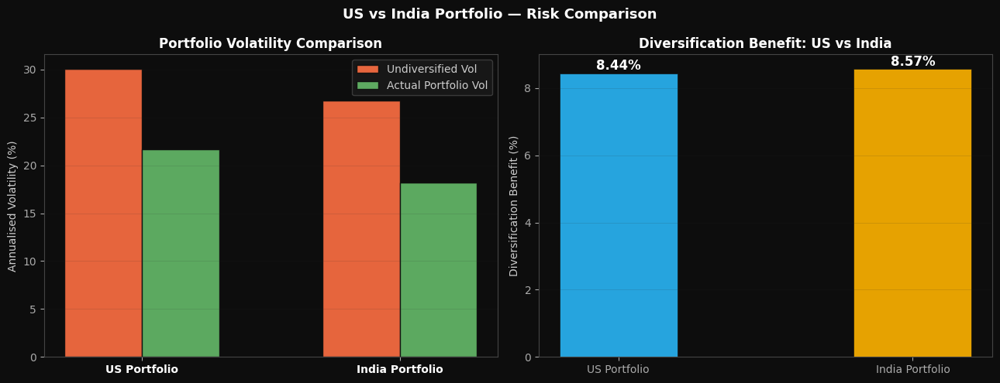

# India Portfolio — Risk Decomposition Analysis

The same CAPM and Portfolio Risk Attribution framework applied to a 5-stock Indian equity portfolio using the Nifty 50 as the market proxy. This analysis serves as a direct comparison to the US portfolio, revealing how risk structure differs between a developed and an emerging market.

---

## Portfolio

| Stock | Ticker | Sector |
|---|---|---|
| Reliance Industries | RELIANCE.NS | Energy / Conglomerate |
| Tata Consultancy Services | TCS.NS | IT Services |
| HDFC Bank | HDFCBANK.NS | Banking |
| Infosys | INFY.NS | IT Services |
| ITC | ITC.NS | FMCG |

**Weights:** Equal-weighted (20% each)  
**Market Proxy:** Nifty 50 (`^NSEI`)  
**Sample Period:** January 2018 — January 2024

---

## Why Fama-French Is Not Applied Here

The Fama-French 3-Factor model requires official SMB and HML factor data constructed from the domestic equity universe. This data is available for the US market through Kenneth French's data library but does not exist in the same standardised form for Indian markets. Applying US factors to Indian stocks would be economically incorrect — the size and value dynamics of Indian equities are driven by different structural forces than US markets. CAPM and Portfolio Risk Attribution are the appropriate models here.

This is not a limitation of the analysis. It is an honest acknowledgement of data constraints — something any rigorous research should address explicitly.

---

## Notebooks

### `india_01_capm_dark.ipynb` — Single Factor Beta Decomposition

Fits a CAPM regression for each Indian stock against the Nifty 50 and decomposes total variance into systematic and idiosyncratic components.

The wide scatter of dots around regression lines immediately signals something different from the US portfolio — the Nifty 50 explains far less of individual stock movements than the S&P 500 does.

**Results:**

| Stock | Beta | R² | Systematic % | Idiosyncratic % |
|---|---|---|---|---|
| RELIANCE | 1.10 | 0.461 | 46.1% | 53.9% |
| TCS | 0.69 | 0.259 | 25.9% | **74.1%** |
| HDFCBANK | 1.05 | 0.575 | 57.5% | 42.5% |
| INFY | 0.83 | 0.292 | 29.2% | 70.8% |
| ITC | 0.72 | 0.267 | 26.7% | 73.3% |

**Key Finding — TCS and INFY:** India's two largest IT exporters have R² values of 0.26 and 0.29 against the Nifty 50 — meaning the Indian domestic market explains less than 30% of their daily movements. The reason is structural: TCS earns approximately 90% of its revenues in USD from US and European clients. When the Nifty falls on domestic inflation fears or RBI policy decisions, TCS is largely unaffected because its business has nothing to do with the Indian consumer economy. It is effectively a global IT services company listed on Indian exchanges.

**Key Finding — HDFCBANK:** The most domestically-driven stock with R²=0.58 and 57.5% systematic risk. Banking revenues are directly tied to RBI policy, credit growth, and domestic GDP — making HDFCBANK the purest proxy for the Indian economic cycle in this portfolio.

**Key Finding — ITC:** Despite being a consumer staples company, ITC has only 26.7% systematic risk. Government tobacco taxation policy — announced annually in the Union Budget — creates violent idiosyncratic moves completely independent of what the Nifty does that day.

---

### `india_02_portfolio_risk_dark.ipynb` — Portfolio Risk Attribution

Combines the five Indian stocks into an equal-weighted portfolio and attributes total portfolio risk back to each position.

**Results:**

| Stock | Weight | Risk Contribution | Status |
|---|---|---|---|
| RELIANCE | 20% | 18.9% | Neutral |
| TCS | 20% | **22.4%** | Over-contributing |
| HDFCBANK | 20% | **16.2%** | Under-contributing |
| INFY | 20% | **23.1%** | Over-contributing |
| ITC | 20% | 19.4% | Neutral |

**Portfolio Volatility:** 18.17% annualised  
**Undiversified (weighted sum):** 26.75%  
**Diversification Benefit:** 8.57%

**Key Finding — INFY is the biggest risk driver despite low market beta:**  
INFY has a beta of only 0.83 against Nifty — appearing defensive — yet it contributes 23.1% of total portfolio risk, the highest of any stock. The reason is individual volatility (29.7% annualised, highest in the portfolio) combined with moderate correlations spread across all other stocks simultaneously. Low market beta does not mean low portfolio risk. What matters is how a stock moves relative to every other holding — not just the market index.

**Key Finding — HDFCBANK is the best diversifier despite high market sensitivity:**  
HDFCBANK has the highest R² against Nifty (0.58) yet contributes the least portfolio risk (16.2%). Its risk drivers — RBI rate decisions, credit cycles, NPA ratios — are genuinely different from oil refinery margins (Reliance), USD tech revenues (TCS, Infosys), and tobacco regulation (ITC). Sector independence matters more than market correlation for portfolio diversification.

**Key Finding — TCS and ITC have surprisingly high correlation (0.62):**  
Two completely different businesses — global IT services and domestic cigarettes — move together more than any other pair in the portfolio. This is not driven by business fundamentals but by institutional investor behaviour. Foreign Institutional Investors (FIIs) hold both as large, liquid, blue-chip positions. When global risk appetite falls and FIIs sell Indian equities broadly, TCS and ITC fall together regardless of their underlying business dynamics. This is a structural feature of emerging markets where FII flows dominate large-cap correlations.

The rolling volatility chart shows the COVID spike in March 2020 reached approximately 55% — almost identical to the US portfolio's 60% peak, confirming that global crises affect both markets simultaneously regardless of domestic differences.

---

## US vs India Comparison

| Metric | US Portfolio | India Portfolio |
|---|---|---|
| Avg Beta vs Index | 0.976 | 0.879 |
| Avg R² | 0.451 | **0.371** |
| Avg Idiosyncratic % | 54.9% | **62.9%** |
| Portfolio Volatility | 21.63% | 18.17% |
| Diversification Benefit | 8.44% | 8.57% |
| Best Diversifier | XOM (11.1%) | HDFCBANK (16.2%) |
| Biggest Risk Driver | AAPL (23.5%) | INFY (23.1%) |

**Core finding:** The Nifty 50 is a weaker explanatory force for individual Indian stocks than the S&P 500 is for US stocks. Indian equities are driven more by company-specific factors, global commodity prices, FII flows, and currency dynamics than by the domestic index. This higher idiosyncratic risk means stock selection matters more in India — passive index exposure captures less of the true risk story compared to US markets.

The diversification benefit is almost identical across both markets (8.44% vs 8.57%), confirming that a well-constructed cross-sector portfolio delivers similar diversification value regardless of whether you are in a developed or emerging market.

---

## Tech Stack

Python · NumPy · Pandas · Matplotlib · Statsmodels · yfinance
