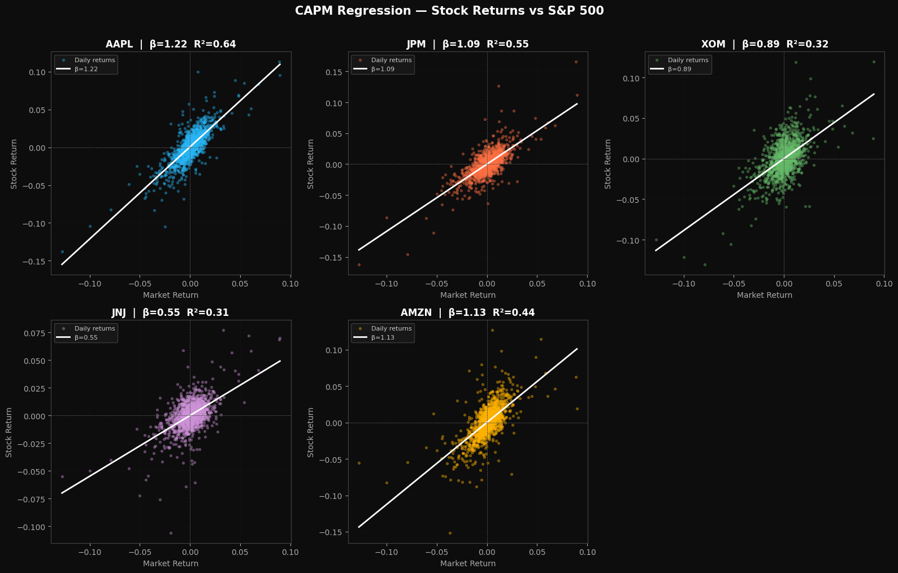
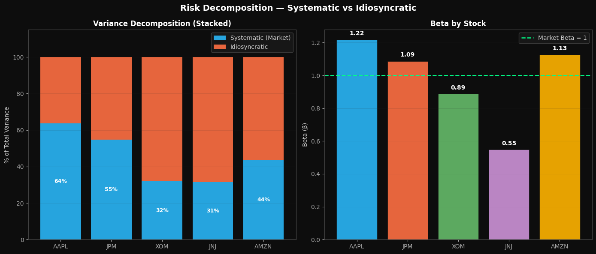
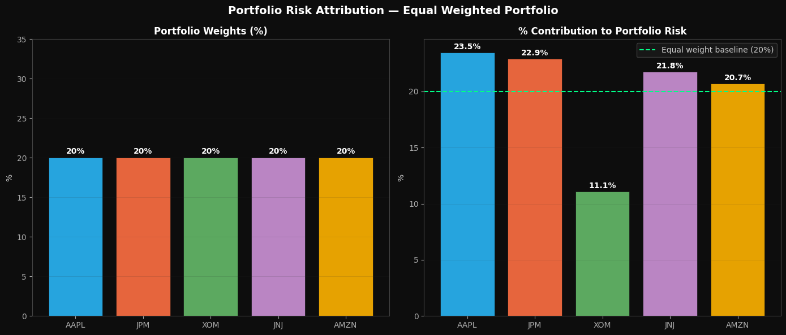
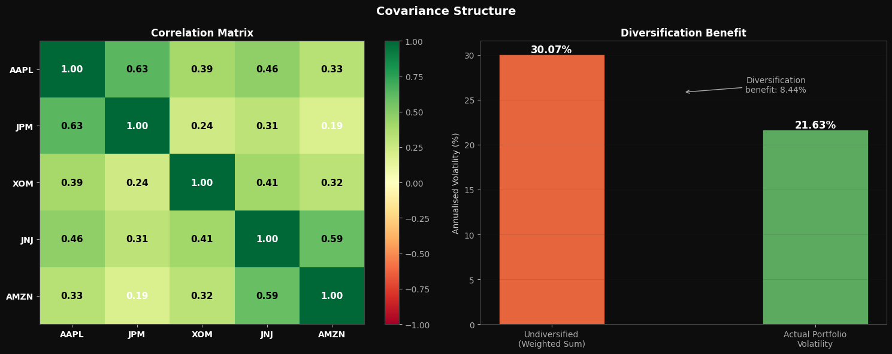
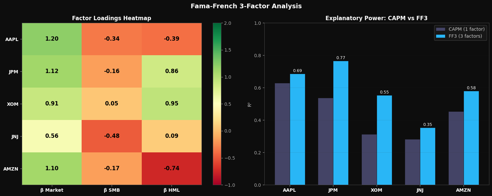

# US Portfolio — Risk Decomposition Analysis

A systematic decomposition of risk across a 5-stock US equity portfolio using three progressive factor models. Each notebook addresses the limitations of the previous one, building toward a complete picture of what drives returns and where risk originates.

---

## Portfolio

| Stock | Ticker | Sector |
|---|---|---|
| Apple | AAPL | Technology |
| JPMorgan Chase | JPM | Financials |
| ExxonMobil | XOM | Energy |
| Johnson & Johnson | JNJ | Healthcare |
| Amazon | AMZN | Consumer / Technology |

**Weights:** Equal-weighted (20% each)  
**Market Proxy:** S&P 500 (`^GSPC`)  
**Sample Period:** January 2018 — January 2024  
*Chosen to capture multiple complete market regimes: COVID crash (2020), post-pandemic bull market (2021), and Fed rate hike cycle (2022).*

---

## Notebooks

### `01_capm_dark.ipynb` — Single Factor Beta Decomposition

Fits a CAPM regression for each stock against the S&P 500 and decomposes total variance into systematic (market-driven) and idiosyncratic (stock-specific) components.

Each scatter plot shows one trading day per dot. The white regression line is the CAPM fit — its slope is beta. AAPL's dots hug the line tightly (R²=0.64) while XOM's dots scatter widely (R²=0.32), revealing that oil price dynamics drive XOM far more than the S&P 500 does.

**Results:**

| Stock | Beta | R² | Systematic % | Idiosyncratic % |
|---|---|---|---|---|
| AAPL | 1.22 | 0.636 | 63.6% | 36.4% |
| JPM | 1.09 | 0.548 | 54.8% | 45.2% |
| XOM | 0.89 | 0.319 | 31.9% | **68.1%** |
| JNJ | 0.55 | 0.315 | 31.5% | **68.5%** |
| AMZN | 1.13 | 0.436 | 43.6% | 56.4% |

**Key Finding:** XOM and JNJ have the highest idiosyncratic risk despite very different characters. XOM is driven by global oil prices and OPEC decisions that have little to do with the S&P 500. JNJ is driven by drug approvals, patent cycles, and litigation outcomes. Both are genuinely independent of the broad market — but for completely different reasons.

**Limitation identified:** CAPM uses only one factor. For JPM and XOM, R² values of 0.55 and 0.32 leave large unexplained portions. This motivates the Fama-French extension in Notebook 03.

---

### `02_portfolio_risk_dark.ipynb` — Portfolio Risk Attribution

Combines the five stocks into an equal-weighted portfolio and attributes total portfolio volatility back to each position using Marginal Contribution to Risk (MCR) and Component Contribution to Risk (CCR).

Every stock has exactly 20% weight — but their risk contributions are far from equal.

**Results:**

| Stock | Weight | Risk Contribution | Status |
|---|---|---|---|
| AAPL | 20% | **23.5%** | Over-contributing |
| JPM | 20% | **22.9%** | Over-contributing |
| XOM | 20% | **11.1%** | Under-contributing |
| JNJ | 20% | 21.8% | Neutral |
| AMZN | 20% | 20.7% | Neutral |

**Portfolio Volatility:** 21.63% annualised  
**Undiversified (weighted sum):** 30.07%  
**Diversification Benefit:** 8.44%

**Key Finding:** XOM has the highest individual volatility (32.56%) yet contributes the least portfolio risk (11.1%). This is entirely explained by its low correlations with the other four stocks — JPM at 0.24, AMZN at 0.32. XOM's risk drivers (commodity prices, geopolitics) are genuinely independent of tech earnings and financial cycles, making it the portfolio's most effective diversifier despite appearing individually volatile.

AAPL and JPM over-contribute because their correlation of 0.63 means they move together — both are high-beta stocks sensitive to the same macro forces, so their risks amplify rather than cancel.

---

### `03_fama_french_dark.ipynb` — Fama-French 3-Factor Decomposition

Extends CAPM by adding two additional systematic factors — SMB (size premium) and HML (value premium) — using daily factor data from Kenneth French's data library.

**Results:**

| Stock | β Market | β SMB | β HML | FF3 R² | CAPM R² | Improvement |
|---|---|---|---|---|---|---|
| AAPL | 1.20 | -0.34 | -0.39 | 0.686 | 0.636 | +5% |
| JPM | 1.12 | -0.16 | **+0.86** | **0.766** | 0.548 | **+22%** |
| XOM | 0.91 | +0.05 | **+0.95** | 0.554 | 0.319 | **+23%** |
| JNJ | 0.56 | -0.48 | +0.09 | 0.354 | 0.315 | +7% |
| AMZN | 1.10 | -0.17 | **-0.74** | 0.581 | 0.436 | +12% |

**Key Finding — Style Separation:** The HML factor reveals a fundamental divide in the portfolio. JPM (HML=+0.86) and XOM (HML=+0.95) are deep value stocks — they trade at low price-to-book ratios and benefit when value beats growth. AAPL (HML=-0.39) and AMZN (HML=-0.74) are growth stocks — they trade at premium valuations and suffer when interest rates rise because future cash flows get discounted harder.

This means the portfolio is not purely directional — it holds both growth and value exposures that partially offset each other across economic cycles.

**Key Finding — Why JPM and XOM improved most:** CAPM was blind to the value premium. JPM and XOM have massive HML loadings that CAPM attributed to unexplained idiosyncratic noise. FF3 reclassified this noise as systematic factor exposure — moving JPM from 55% to 77% explained and XOM from 32% to 55% explained.

**Key Finding — JNJ remains unexplained:** Even with three factors, JNJ's R² only reaches 0.35. Healthcare dynamics — FDA approvals, drug pipeline events, litigation outcomes — are genuinely idiosyncratic and cannot be captured by market, size, or value factors. This is not a model failure; it confirms that JNJ's risk profile is fundamentally different from the other four stocks.

---

## Summary of Key Findings

**1. Equal weight ≠ equal risk**  
With identical 20% allocations, AAPL contributes 23.5% of portfolio risk while XOM contributes only 11.1%. Position sizing by weight is not risk management.

**2. Individual volatility ≠ portfolio risk contribution**  
XOM is the most volatile individual stock (32.56%) but the best portfolio diversifier (11.1% risk contribution). What matters is not how volatile a stock is alone, but how it moves relative to everything else in the portfolio.

**3. CAPM underestimates systematic risk**  
By adding just two factors, FF3 reclassified significant portions of apparent idiosyncratic risk as systematic factor exposure — particularly for JPM (+22% R²) and XOM (+23% R²). Risk that looks stock-specific under CAPM is often factor-driven when viewed through a richer model.

**4. The portfolio contains a value vs growth divide**  
JPM and XOM are value stocks; AAPL and AMZN are growth stocks. These groups perform differently across macro regimes. Understanding this divide explains why the portfolio behaves differently in rate hike environments vs low-rate expansions.

---

## Tech Stack

Python · NumPy · Pandas · Matplotlib · Statsmodels · yfinance
